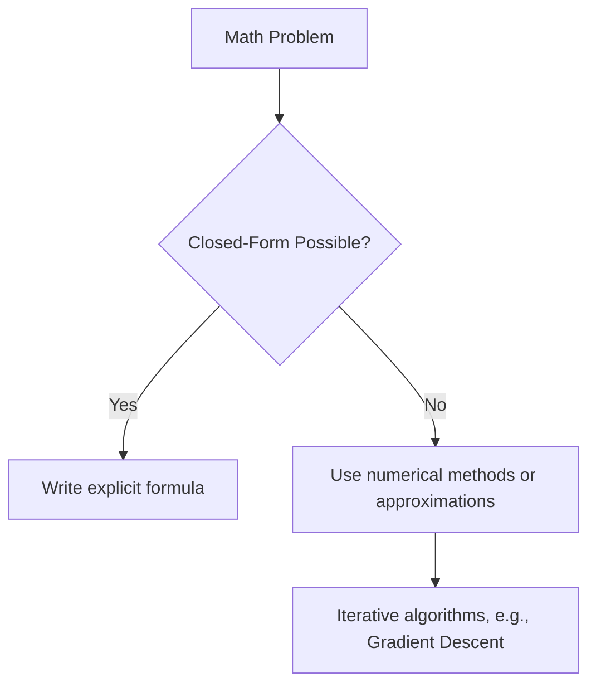

!!! warning
    This is just an outline of the Closed-Form Solution content. The complete material will be uploaded under Math for Machine Learning by April 21, 2025.

    Author: mathiyuvarajan.dev@gmail.com

# Closed-Form Solution

Understanding closed-form solutions is essential in mathematics, machine learning, and engineering.

---

## What is a Closed-Form Solution?

A **closed-form solution** is an explicit equation or formula that can be evaluated in a finite number of operations using well-known functions (e.g., polynomials, exponentials, logarithms, trigonometric functions).

In simple terms:

> If you can write the answer down as a neat equation, without needing iteration or approximation — that’s a closed-form solution.

---

## Formal Definition

A solution \( x \) is said to be **closed-form** if it can be expressed analytically using a finite number of:
- algebraic operations (addition, subtraction, multiplication, division)
- exponentials and logarithms
- constants and known functions (e.g., sine, cosine)

**Mathematically:**

A function \( f \) is **closed-form** if:

$$
f(x) = \text{an expression involving only known operations/functions}
$$

---

## Examples

### 1. Solving a Linear Equation

Given:

$$
ax + b = 0
$$

The closed-form solution is:

$$
x = -\frac{b}{a}
$$

This is a classic closed-form solution — simple, direct, and doesn't require iteration.

---

### 2. Quadratic Equation

For:

$$
ax^2 + bx + c = 0
$$

The closed-form solution is:

$$
x = \frac{-b \pm \sqrt{b^2 - 4ac}}{2a}
$$

---

## ⚠️ Not Always Possible

Not all problems have a closed-form solution. For example, integrals like:

$$
\int e^{-x^2} dx
$$

do not have a closed-form solution using elementary functions, which is why the error function \( \text{erf}(x) \) was defined.

---

## Visuval

