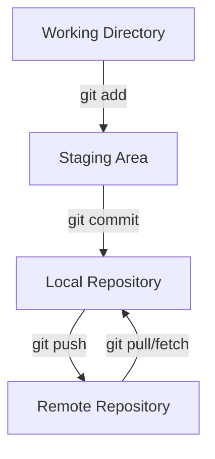

# Git Workflow

A typical Git workflow involves the following stages:

- Working Directory: The files in your project folder that you edit.
- Staging Area: A place where changes are staged (indexed) before committing.
- Repository (Local): A local database that tracks your project's history.
- Remote Repository: A shared repository hosted on platforms like GitHub, GitLab, or Bitbucket.

## Steps in a Git Workflow

- Modify files in the working directory.
- Stage changes using git add to move them to the staging area.
- Commit staged changes with git commit to save them to the local repository.
- Push commits to the remote repository using git push.
- Fetch or pull updates from the remote repository when needed.




---

### Explanation of the Diagram
1. **Working Directory**: This is where you create or modify files.
2. **Staging Area**: Staging lets you prepare changes for the next commit.
3. **Local Repository**: Commits are saved locally, forming the project's history.
4. **Remote Repository**: You push changes to share your work with others or back it up.

---

### Few Git Commands

Initialize a Git repository 

```
git init
```

Stage changes
```
git add <file-name> 
```
Commit Changes
```
git commit -m "Commit message"
```
Push to github or any provider repo
```
git push origin main
```
Pull from github or any online provider 
```
git pull origin main
```