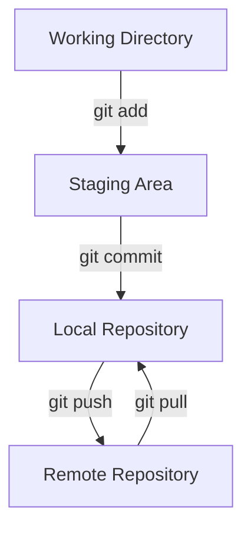
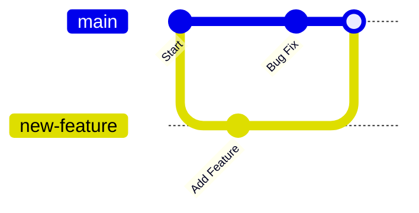

# Git Commands for Beginners (Explained Like You're 5 year old !)

Git is like a magic notebook for your code. It helps you **save** your work, **look back** at older versions, and **share** your projects with friends. Let’s break it down step by step.

---

## Important Git Terminology (Simple Words)

- **Repository (Repo)**: A folder where Git keeps track of all your files and their history. Think of it like your magical chest where all your treasure (code) is stored.
- **Working Directory**: The place where you work on your files. It’s like your playground.
- **Staging Area**: A clipboard where you put the things you want to save.
- **Commit**: Taking a snapshot of your work and saving it in your repo chest.
- **Remote**: Your treasure chest in the cloud where everyone can see or work with your files.
- **Push**: Sending your work from your computer to the cloud.
- **Pull**: Bringing work from the cloud to your computer.
- **Branch**: A copy of your playground where you can play without messing up the main playground.
- **Merge**: Combining your playground with the main playground.

---

## Basic Git Workflow

This is how Git works:

1. You work on your files.
   
2. You decide what changes to keep (stage them).
   
3. You save a snapshot (commit).
   
4. You share it with the world (push).

---

## Git Workflow



# Git Commands (All the Magic Words You Need)

## 1. Setup Commands (Tell Git who you are)

###  Set your name

```
git config --global user.name "Your Name"
```
 
### Set your email
```
git config --global user.email "your.email@example.com"
```

## 2. Starting a Project

### Create a new Git repo
```
git init
```

### Clone a repo (copy it from the cloud to your computer)
```
git clone <repo-url>
```

## 3. Staging and Committing

### Check the status of your files
```
git status
```

### Add a single file to the staging area
```
git add <file-name>
```

### Add all files to the staging area
```
git add .
```

### Commit the staged changes
```
git commit -m "A description of what I did"
```
### Pushing and Pulling
 
### Push changes to the remote repo
```
git push origin main
```

### Pull changes from the remote repo
```
git pull origin main
```
## 5. Branching and Merging

### Create a new branch

```
git branch <branch-name>

```
### Switch to a branch
```
git checkout <branch-name>


```
### Merge a branch into the main branch
```
git merge <branch-name>
```

## 6. Viewing History
### Show commit history
```
git log
```
###  Show a simplified one-line history
```
git log --oneline

```
## 7. Undoing Changes

### Unstage a file (remove from staging)

```
git reset <file-name>
```

### Undo the last commit but keep changes
```
git reset --soft HEAD~1
```

### Undo the last commit and delete changes
```
git reset --hard HEAD~1
```

## 8. Working with Remotes
### Add a remote repo
```
git remote add origin <repo-url>
```
### View remotes
```
git remote -v
```
### Remove a remote
```
git remote remove origin
```

# Branching and Merging

